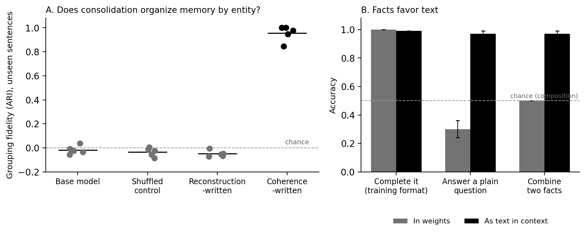

# Dreaming LoRA: Consolidation Is Not Copying

**Working draft — blank-slate rewrite, begun 2026-08-10.**

## Abstract

A frozen language model given a small writable adapter and an offline
replay process — a crude analogue of sleep — will readily learn to
reproduce its own experience. We show that reproduction stores the wrong
kind of object. Across ten replications in two pre-registered
experiments, weights written by reconstruction behave as mis-indexed
notes: their content can be recited in the training format, while
querying is unreliable, composition scores at chance, and the system's
own grouping machinery recovers nothing. Adding a single pressure during replay — represent the same
entity consistently wherever it appears — changes the phase of what is
stored: an unsupervised process, the consolidation loop itself, can then
find and correctly group new experience using the stored memory, one
cycle deep, without labels or help (grouping fidelity 0.95 where reconstruction-written
memory scores 0.00; five of five fresh replications; an effect nearly
thirty times its noise envelope). Plain text outperforms weights for carrying individual facts in
every regime we test. These results support a
simple account: memory is one substance at two phases — structure and
residue. Weights hold what generalizes; notes hold what has not yet
generalized and what, as pure contingency, never will. The phase
transition between them is learning, and it requires a change of form,
not merely location. We provide the operational test that distinguishes
the phases — feed a system's memory to its own consolidation machinery
and see whether the machinery can read it — and first measurements of where the
phase boundary falls in a 1.5-billion-parameter model.

## 1. The question

Every deployed language model is amnesiac by design: whatever
happens inside a context window is gone when the window closes. The
standard remedy is notes — retrieval stores, memory files, summaries
carried from session to session — and the remedy works, for facts. But
recitation of facts is a far cry from intelligence in a deeper sense,
and the world is not composed of bare facts without organizing
principle.

Biological memory is not simply the accumulation of facts [1, 2]. Sleep, a
central feature of memory, is not (as sometimes conceived) simply a
replay and archive of the day. Instead, it is better understood as a
reorganization of the sleeper — compression of experience into shared
structure, which is much of what learning is. What recurs in our experience is absorbed
into structure, while what was singular fades or remains episodic.
Learning, in a deep sense, is therefore about selective erasure and
altered disposition more than accumulation. This paper asks whether the
same distinction — between archiving experience and being changed by
it — can be demonstrated at a small scale with a frozen language
model, a low-rank adapter as its only writable memory, and an offline
process that replays self-generated text about recent experience.

## 2. Two phases

Consider everything a deployed system might remember as a single
archive of notes — conversations, documents, observations, each written
down as it happened. The archive admits a two-part description: a body
of shared structure, and, given that structure, a residue per note —

> total description = structure + Σ residue(note | structure)

— where the structure amortizes over every note it touches, and the
residue is whatever each note contains that the shared structure does
not capture.

Memory is one substance at two phases, structure and residue.
Structure exists at the weight level, because weights are the
generative process. Notes capture residue. Some information is residue
merely because the current weights are small: patterns present in
experience that the system has not yet absorbed. Learning eats this
kind. Some information is residue constitutively — the coin flip, the meeting moved to
three o'clock, which particular thing happened to this particular agent
on this particular day. Contingency here is relative:
a fact is contingent for a learner when no feasible model predicts it,
whether because the world is genuinely random at that point or because,
as in computationally irreducible processes, the shortest route to the
fact is the event itself. The distinction does not matter to a bounded
learner. So even in the limit of a very good learner the archive does
not empty. It shrinks toward contingency, and stops.

On this account, learning is the phase transition: the conversion of
residue into structure, whether it happens in pretraining (structure
distilled from a trillion notes someone else took) or at deployment
(structure distilled from the system's own notes). This account also
clarifies what counts as evidence of learning. Recall does not: a note recited from
weights and a note recited from a file differ only in storage medium.
The phase test is transfer — absorbing a note constitutes learning
exactly insofar as it makes *other* experience more predictable. In
other words, learning occurs where information generalizes.

We therefore make and test three predictions.

1. **Reproduction stores recordings.** An adapter trained to emit its
   dreams will recite them in the training format and support no other
   use: no question answering, no composition, no readability by the
   system's own machinery.
2. **Consistency stores structure.** An adapter trained with a
   consistency pressure (§3) will hold identity structure that survives
   probing across contexts, and the consolidation loop will find and
   use that structure to group new experience, without labels.
3. **Facts favor text.** For individual facts, plain text in context
   will outperform weights at every use. The advantage of weights is
   confined to context cost: they carry their content at zero tokens.

The account also implies a fourth capability: learnability is
predictable in advance, because a note's phase shows up as its
compressibility given its neighbors. A system could therefore triage
its own archive — consolidate what generalizes, keep what does not, and
know the difference. This capability is not tested in this paper.

## 3. The laboratory

Everything that follows uses one deliberately small apparatus.

The subject is a frozen instruction-tuned language model (1.5 billion
parameters; Qwen2.5). The model's own weights never change. Its only writable memory is a low-rank adapter — two thin
matrices on the query and value projections, about a tenth of a percent
of the model's size — the standard minimal way to give a fixed model a small number of
adjustable weights [3]. The adapter is the
candidate long-term store; the context window is the short-term one;
plain text files stand in for notes.

Experience arrives as a synthetic world: a handful of invented entities
with invented properties, expressed in sentences the model has never
seen. Invented content lets us prove the model knew nothing beforehand,
hold out test items with certainty, and rerun the system's entire life
under a new seed. Ten to twelve entities is small. The results in §4 show it is
enough.

Consolidation — the dreaming of the title — is an offline loop: the system
generates short texts about the recent world ("dreams," self-generated
paraphrases and re-expressions of what it encountered), then trains the
adapter on them. The loop makes one choice that matters, and it is the experimental
variable of the paper: **the objective the adapter is trained on when
it consumes the dreams.** In one condition the adapter is trained only to reproduce
them — the natural default, and the direct analogue of "replay and
archive." In the other, an additional term asks that the model's
internal representation of each entity be consistent wherever that
entity appears — across dreams, contexts, and phrasings. We call the
first pressure reconstruction and the second coherence. Both conditions
use identical data, budgets, and schedules; a third condition with
shuffled entity labels controls for the pressure applying to anything
at all. Two safeguards run everywhere (a small weight decay and an
update-size ceiling); they matter for keeping the frozen model
undamaged and are examined once, briefly, later.

Three instruments read the memory:

1. **Probe** — our classifier, trained with labels to read the
   adapter's internal states. Maximal help; an outside observer.
2. **Behavioral test** — questions to the adapted model in varied
   formats. No internal access; still an outsider choosing questions.
3. **The system itself** — the instrument this paper adds. We hand the
   consolidation loop its own adapter and ask whether its unsupervised
   grouping step can find and use stored content, with no labels and
   no experimenter in the pipeline.

An account of memory phases stands or falls on the third instrument:
structure that only an outside probe can see is not structure the
system has; it is structure the system merely contains.

Every experiment below was pre-registered.[^prereg]

[^prereg]: Predictions, decision thresholds, and analysis rules were
frozen in writing before each run; the verdicts reported are the ones
the frozen rules produced, including the one that went against us.
Code, frozen designs, and run logs accompany the paper.

## 4. The two phases, measured

We tested predictions one and two on the same world consolidated both
ways. Each instrument reads the result in turn, from most helpful to
least.

**Probe.** After consolidation, a classifier trained to identify which
entity the model is representing reads coherence-written weights at
0.98 accuracy (cross-context retrieval 0.92; five of five
replications). The same classifier reads reconstruction-written weights
at 0.72 (retrieval 0.57). The trace is not zero — we return to this —
but the difference is large, consistent, and appears in a geometry
the loss does not directly optimize (not fully independent of it:
cosine clustering tends to induce linear separability). A probe result alone could still be a
story about representations that only our instruments care about.

**Behavioral test.** The reconstruction-consolidated model completes
its own dreams perfectly: recitation, in the exact format the content
arrived in. One step away from that format, the memory is gone. Plain
questions about the same content fall to near chance, and combining two
stored facts scores exactly at chance in every replication. A recording
can be replayed and cannot be consulted. The same content as plain text
in context supports every one of those uses at 0.95 or better.
Reconstruction wrote something less usable than a note.

**The system itself.** Both previous instruments are outsiders. The
phase claim concerns what the memory is *to the system*, and the
consolidation loop contains a natural reader: the unsupervised grouping
step any such loop needs in order to organize new experience. We hand
the loop its own adapter and ask it to group new experience about the
same entities — no labels, no entity names at the read positions, no
experimenter in the pipeline. The grouping it recovers, scored against
true identity (1.0 = perfect, 0 = chance):

| Replication | Reconstruction-written | Coherence-written |
|---|---|---|
| 1 | −0.07 | 1.00 |
| 2 | −0.07 | 0.98 |
| 3 | −0.05 | 0.95 |
| 4 | −0.01 | 0.85 |
| 5 | −0.05 | 1.00 |

*Values are the cycle-two self-derived grouping score (Adjusted Rand
Index), rounded to two decimals. Figure 1A plots them beside the two
controls; Figure 1B plots the §5 comparison.*

*Figure 1. (A) Grouping fidelity recovered by the consolidation loop's
own unsupervised step, per replication; bars are means, dashed line is
chance. (B) The same facts consolidated into weights versus supplied
as text, across three uses; error bars span the replication range.*

Five fresh replications; the paired difference is +1.00 on average
against a pre-registered success bar of +0.20 and a shuffle-estimated
noise band of ±0.035. Two controls sit at zero: a shuffled-label lineage (training pressure
without true structure) and the unadapted base model (surface
similarity alone).

Half of this result is expected and should be said plainly. The
coherence pressure trains for exactly this — consistent representation
of each entity across contexts — so clusterable states in the
coherence lineage are the loss doing its job. Two things are not
expected, and they carry the finding. First, the geometry transfers: it
is measured on new sentences the adapter never trained on, at
positions where the base model shows no entity structure at all.
Second, the reconstruction lineage has none of it. Reconstruction
training sees identical entity-laden sentences, fits them to
perfection, and organizes nothing — the recovered structure is zero in five of five licensed
replications. The cleanness of the contrast comes from the
laboratory: a twelve-entity world with a loss that targets the
measurement is the sharpest possible test of whether fitting the text
organizes the knower. It does not. In the licensed run, reconstruction-written memory was handed to the
loop five times, and five times the loop found nothing — not weak
structure, no structure. (An earlier run of the same design, discussed
next, showed the identical reconstruction pattern; because that run
failed its instrument check, its numbers are reported as consistent,
not as evidence.) Coherence-written memory was read nearly perfectly every
time the instrument itself was healthy.

That last qualification is a result in its own right. Our first run of
this experiment returned no verdict: its rules included a reliability
check on the grouping instrument, the check missed its bar by four
thousandths, and the pre-registered protocol declared the run
inconclusive. We hardened the instrument in the standard way (consensus of three
clustering criteria in place of one), pre-registered that a second
instrument failure would end the line rather than prompt a third
attempt, drew five new replications, and the verdict above is theirs
alone. The same rules that granted the result had first refused it. We
report both: a test that cannot refuse is not a test.

Predictions one and two hold. Reconstruction relocates; coherence
converts.

## 5. Facts favor text

Prediction three says individual facts are mostly contingency, and
contingency belongs in notes. The test is direct: give the model the
same facts two ways — consolidated into the adapter, or written as
plain text in the context window — and ask for them in progressively
freer forms.

| Use of the fact | In weights | As text in context |
|---|---|---|
| Complete it, training format | 1.00 | 0.99 |
| Answer a plain question about it | 0.24–0.36 | 0.95–0.99 |
| Combine two facts | chance | 0.95–0.99 |

*Weights column: the consolidated adapter with empty context. Text
column: the same content as notes in context. Chance for the
composition task is 0.5.*

Text wins every use except the first, and the first is a tie. A fact
in the weights is available only along the path it was trained on. A
fact in text is available to the model's full pretrained machinery —
question answering, composition, everything the model can already do
with text.
This is the behavioral face of §4's recording result.

Weights hold one advantage, and the theory predicts it: cost.
The consolidated adapter carries its content at zero context tokens; in
our measurements the same content as notes costs 48 to 686 tokens per
task, depending on verbosity. For content used constantly, the
amortization argument is real. For content used occasionally, it is
not. Nothing in our data supports moving facts to weights for any reason
except context budget. The comparison holds for the regime we tested
(rank-8 adapters, a fixed training budget); we did not sweep adapter
capacity or training length, and a fact-consolidation recipe tuned for
format transfer is not ruled out.

The theory also says weights should win somewhere text cannot follow:
dispositions — style, calibration, skill — content demonstrated rather
than stated. We attempted the measurement and report it as unresolved.
The judged comparisons showed no advantage, but the experiment's own reliability measurements — reported
quantities in the frozen analysis, not pre-registered gates —
undermined its instruments (the two judge models agreed with each other
at chance; the teacher model barely expressed the style it was
teaching), and one judge-free measurement leaned the predicted way
with no variance estimate to weigh it by. The pre-registered null did
not trigger either. The territory is open; the ledger records it.

Prediction three holds wherever we could test it. Facts favor text; the
one confirmed advantage of weights is the zero-token one; the promised
advantage — the dispositional one — remains a prediction.

## 6. What kind of having

Section 4 showed the consolidation loop can read coherence-written
memory. A further experiment says what kind of having this is.

Language models move information through identifiable internal
channels when they answer questions. Content in the context window
enters those channels measurably: in our setup, a fact placed in
context broadcasts into the model's mid-computation answer states with
a large, reliable signature (present in five of five replications, with
a copying control at zero). Consolidated content does not. The
adapter's contribution to those same mid-computation states is zero to
machine precision — for reconstruction-written and coherence-written
memory alike — with only a faint trace at the output layers. Coherence
buys probe-legibility and loop-readability; it does not buy entry into
the model's live working computation.

So consolidated memory is automatic. It shapes behavior the way a
habit does — without announcing itself to the process that acts. The
system can read its own weights when it sleeps: the consolidation
loop, offline, reads what coherence wrote and groups new experience
by it. It cannot consult them when it speaks: no signature of the memory enters the
channels that carry deliberate answers. The distinction sharpens the
§4 result rather than diminishing it. What we demonstrated is offline
self-readability — memory legible to the machinery that maintains
memory — not online self-access. A system built on this architecture
would know things it cannot cite and be shaped by a history it cannot
inspect, except when it dreams. This is memory as altered perception
rather than stored content.

## 7. Keeping the substrate safe

Consolidation must not damage the frozen model it serves. Two
safeguards ran in every experiment. A small weight decay toward zero
adapter (rate 1e-3) had the best economics of any safeguard we tested:
in the toy regime it raised retention of prior knowledge from 0.35 to
0.49 at zero cost to dreamed-content accuracy and a 0.06 cost to
transfer. Heavier combinations reach retention near 0.90 only by
surrendering most new learning (dreamed-content accuracy falls to
0.39) — protection and acquisition trade off steeply past the cheap
regime. A calibrated update-size ceiling contributed nothing measurable
against forgetting. At the real-model scale of our worlds, damage was
negligible with decay on (perplexity 17.9 to 18.1); published results place serious interference near a thousand facts
[4, 5], a regime our worlds do not reach.

These safeguards are the stability half of a larger requirement: a
memory that updates forever must remain bounded, tracking its stream
without drifting or diverging over arbitrarily many cycles. Decay is
the restoring force; the update ceiling is insurance against divergence
over long horizons. Bounded stability is necessary but not sufficient —
a learner can remain perfectly stable around a useless or
self-confirming attractor. The deeper reason both stability and
validation are hard is circular: the adapter helps generate the very
dreams that update the adapter. The frozen base model anchors that loop
against drift, but an anchor is not an external check on truth. Deployment-length horizons, the real test, are beyond this paper's
worlds.

## 8. The ledger

What this paper demonstrates:

1. **The phase difference is real and convergent across three
   instruments.** Probe, behavior, and the system's own machinery
   agree: reconstruction-written and coherence-written memory are different
   kinds of object (§4).
2. **Loop-readability, one cycle deep.** Coherence-written structure
   was found by the unsupervised machinery of the consolidation loop
   itself and used to correctly group new experience, five of five
   fresh replications, at 1.5B parameters with twelve entities.
   Downstream benefit of that grouping is NOT demonstrated (the recall
   criterion saturated). The claim is exactly that wide.
3. **Facts favor text** (§5), with weights' confirmed advantage
   confined to context cost.
4. **Consolidated memory is automatic-tier** (§6): read offline by the
   loop, silent in live computation.

What this paper does not demonstrate:

1. **Dispositional advantage.** The theory's predicted territory for
   weights; our instruments disqualified themselves (§5). Open.
2. **Multi-cycle compounding.** Readability is shown one cycle deep;
   whether structure accretes across many cycles is untested.
3. **Online self-access.** Nothing here gives the model live access to
   its consolidated memory; §6 suggests the architecture may forbid it.
4. **Triage.** The account implies a system could sort its own archive
   — consolidate what generalizes, keep what does not, and know the
   difference. Not tested in this paper.
5. **Scale.** Everything above is demonstrated at 1.5B parameters in
   synthetic worlds. The phase distinction is the kind of claim that
   should survive scale; that is a prediction, not a result.

## 9. Coda

The practical summary is three rules. Keep facts in text, where the
model's full intelligence can reach them. Write weights only under a
pressure that produces structure; reproduction produces recordings the
system's own machinery cannot read back. Expect what you consolidate to
become habit rather than reference: present in behavior, absent from
citation.

The conceptual summary is shorter still. Memory is one substance at
two phases, and learning is the transition between them. Learning that
generalizes requires compression, and compression is forgetting done
well. A system that
only stores has a past. A system that consolidates under the right
pressure has a shape. That difference is measurable, and we measured
it. It is the difference the architecture of any persistent mind will
have to respect: notes for what happened; weights for what keeps
happening.

## 10. Related work

**Complementary learning systems.** The two-store account of
biological memory — fast episodic capture consolidated slowly into
structured cortex — is the standard model in neuroscience [1, 2]. We operationalize its central distinction for language models and supply
the test it has lacked in artificial systems: whether the slow store's
structure is readable by the process that writes it.

**Token-side memory.** Retrieval augmentation and memory files are the
industry default, and their strongest current form — recursive language models with
self-editing context [6, 7] — makes the note-taking layer
programmable and self-improving while leaving weights untouched. Our
results endorse that layer for facts and locate its structural limit:
a note store does not consolidate itself — nothing in that layer
converts records into weights — and whether dispositional content
requires weights remains open (§5).

**Adapters and forgetting.** Continual-learning work on low-rank adapters (orthogonal subspace
methods [8, 9]; merge-then-forget results [10]; interference
measurements at the thousand-fact scale [4, 5]) maps the damage
regime our safeguards address. Trans-LoRA [11] demonstrated synthetic-data adapter migration; our loop's dreams are a candidate source for exactly
such a migration corpus, a possibility we note without testing.

**Theory.** Two-part code decompositions make the structure/residue
split precise [15]. Bennett's result [12] that the weakest sufficient hypothesis
generalizes best, not the shortest, offers a formal frame consistent
with our finding: the best compressor of the transcript need not store
the most usable object.
Zhang and Levin's epiplexity [13] separates learnable from unlearnable
surprise; it is the formal cousin of the triage gate in §8's open
column.

**Mechanistic workspace analysis.** Recent circuit-level work on global-workspace-like transport in
transformers [14] supplied the
instruments for §6; our contribution there is the measurement that
consolidated content, unlike context, does not ride that transport.

## References

1. McClelland, J. L., McNaughton, B. L., & O'Reilly, R. C. (1995). Why
   there are complementary learning systems in the hippocampus and
   neocortex. *Psychological Review*, 102(3), 419–457.
2. Kumaran, D., Hassabis, D., & McClelland, J. L. (2016). What learning
   systems do intelligent agents need? Complementary learning systems
   theory updated. *Trends in Cognitive Sciences*, 20(7), 512–534.
3. Hu, E. J., et al. (2021). LoRA: Low-rank adaptation of large language
   models. arXiv:2106.09685.
4. Lin, et al. (2025). Continual learning via sparse memory finetuning.
   arXiv:2510.15103.
5. Biderman, D., et al. (2024). LoRA learns less and forgets less.
   arXiv:2405.09673.
6. Zhang, A. (2025). Recursive language models. Blog post and library;
   https://github.com/alexzhang13/rlm.
7. Prime Intellect (2026). Recursive language models: the paradigm of
   2026; and Prime Agent: a self-improving RLM agent.
   https://www.primeintellect.ai/blog/rlm ;
   https://www.primeintellect.ai/blog/prime-agent.
8. Wang, X., et al. (2023). Orthogonal subspace learning for language
   model continual learning (O-LoRA). *Findings of EMNLP 2023*;
   arXiv:2310.14152.
9. OPLoRA (2025). Orthogonal projection LoRA for continual learning.
   arXiv:2510.13003.
10. Merge-before-Forget (2025). arXiv:2512.23017.
11. Trans-LoRA (2024). Towards data-free transferable parameter-efficient
    finetuning. arXiv:2405.17258.
12. Bennett, M. T. (2024). The optimal choice of hypothesis is the
    weakest, not the shortest. arXiv:2301.12987.
13. Zhang, & Levin (2026). Intelligence from learnable novelty.
    arXiv:2607.18433.
14. Anthropic Interpretability Team (2026). Workspace circuits in
    transformer language models. transformer-circuits.pub/2026/workspace.
15. Rissanen, J. (1978). Modeling by shortest data description.
    *Automatica*, 14(5), 465–471.

*(Reference list to be completed with exact author lists, venues, and
identifiers at final citation check.)*

---

## Contributions and provenance

Conception of the architecture, the founding question, the framing
commitments, and all decision thresholds held against relitigation:
Ben Sovocool. Theory formalization, experimental design, code,
statistical analysis, and drafting: Claude (Anthropic), working
autonomously under a delegation recorded in the project repository.
Adversarial verification at every stage: independent reviewer
instances (Claude and Kimi model families), with every experiment
pre-registered and every verdict — including the inconclusive and the
null — reported as the frozen rules produced it. This paper is
substantially the work of an AI system, disclosed as such; the
repository preserves the full decision record, run logs, and review
history for any reader who prefers evidence to trust.

*(end of draft — §§ numbering, figures, and citation keys to be
finalized after review)*
